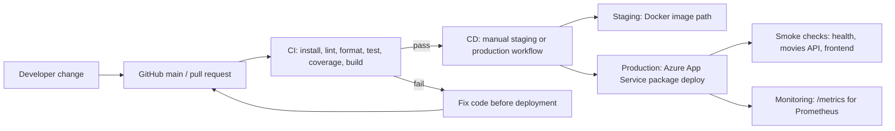

# MERN Movies App DevOps Pipeline

Final project repository for **ES234632 - Pengembangan Sistem dan Operasi**.

This project takes the original `HuXn-WebDev/MERN-Movies-App` MERN movie app and extends it into a DevOps final project with automated quality gates, CI/CD workflows, Docker support, Azure App Service deployment, production smoke checks, and Prometheus metrics.

## Team

- Group name: MERN Movies DevOps Team
- Contributors:
  - Hizkia Crisantino (`@isan40-IS`)
  - Heber Bryan Hutajulu (`@heberbryan`, 5026231204)
  - farisabqori (`@farisabqori`)
  - CowCatt (`@CowCatt`)

## Project Goal

The movie app is the sample application. The real final-project goal is to prove that the team can automate a software delivery lifecycle:



## Application Features

- Public movie browsing, details, newest/top/random movie sections
- Movie search and filtering by name, genre, year, and rating
- User registration, login, logout, and profile update
- Cookie-based JWT authentication
- Admin-only movie and genre management
- Movie reviews and admin comment moderation
- Image upload for movie assets
- Backend health endpoint and Prometheus metrics endpoint

## Tech Stack

| Layer      | Technology                                                            |
| ---------- | --------------------------------------------------------------------- |
| Frontend   | React 18, Vite, Redux Toolkit, RTK Query, Tailwind CSS                |
| Backend    | Node.js, Express, MongoDB, Mongoose                                   |
| Auth       | JWT stored in HTTP-only cookies                                       |
| Testing    | Jest, Supertest, MongoDB Memory Server, Vitest, React Testing Library |
| Quality    | ESLint, Prettier, coverage thresholds                                 |
| CI/CD      | GitHub Actions                                                        |
| Containers | Docker, Docker Compose                                                |
| Deployment | Azure App Service                                                     |
| Monitoring | Prometheus metrics endpoint, Prometheus/Grafana compose services      |

## Repository Structure

```text
backend/                 Express API, routes, controllers, models, tests
frontend/                React/Vite app and frontend tests
.github/workflows/       CI, CD, and production smoke workflows
docs/                    Final report, test docs, deployment docs, demo script
docker-compose.yml       Local MongoDB, backend, frontend, Prometheus, Grafana
Dockerfile.backend       Backend container image
Dockerfile.frontend      Frontend static container image
jest.config.cjs          Backend test and coverage configuration
```

## Quick Start

```bash
npm run setup
copy .env.example .env
npm run fullstack
```

Local URLs:

- Frontend: `http://localhost:5173`
- Backend: `http://localhost:3000`
- Health: `http://localhost:3000/api/v1/health`
- Metrics: `http://localhost:3000/metrics`

## Command Reference

| Command                          | Purpose                                              |
| -------------------------------- | ---------------------------------------------------- |
| `npm run setup`                  | Install root and frontend dependencies with `npm ci` |
| `npm run fullstack`              | Run backend and frontend together                    |
| `npm run lint`                   | Lint backend and frontend                            |
| `npm run format:check`           | Check Prettier formatting                            |
| `npm run test:backend:coverage`  | Run backend tests with coverage gates                |
| `npm run test:frontend:coverage` | Run frontend tests with coverage gates               |
| `npm run test:all`               | Run backend and frontend coverage suites             |
| `npm run build:frontend`         | Build frontend production assets                     |
| `npm run docker:build`           | Build backend and frontend Docker images             |
| `npm run compose:up`             | Run the local Docker Compose stack                   |
| `npm run compose:down`           | Stop the local Docker Compose stack                  |

## CI/CD Pipeline

### CI Pipeline

Workflow: `.github/workflows/ci.yml`

Runs on pushes to any branch and on pull requests targeting `main`:

1. Checkout repository.
2. Setup Node.js 22.
3. Install backend/root and frontend dependencies with `npm ci`.
4. Run backend and frontend linting.
5. Run Prettier format check.
6. Run backend tests with coverage.
7. Run frontend tests with coverage.
8. Build frontend production assets.
9. Upload backend and frontend coverage artifacts.

### CD Pipeline

Workflow: `.github/workflows/cd.yml`

Runs after the `CI Pipeline` completes successfully on `main`:

- `staging` builds and pushes Docker images to Azure Container Registry for the container-based path.
- `production` waits for staging, then builds deployment packages and deploys backend/frontend to Azure App Service with publish profiles.
- Production deployment ends with a backend health smoke check.

### Production Status

Workflow: `.github/workflows/production-status.yml`

Runs on pushes to `main` and manual dispatch. It verifies:

- Backend health endpoint
- Movies API endpoint
- Frontend URL

## Production Environment

- Frontend: `https://mernmovies-web-node-81448.azurewebsites.net`
- Backend: `https://mernmovies-api-node-81448.azurewebsites.net`
- Health: `https://mernmovies-api-node-81448.azurewebsites.net/api/v1/health`
- Movies API: `https://mernmovies-api-node-81448.azurewebsites.net/api/v1/movies/all-movies`
- Metrics: `https://mernmovies-api-node-81448.azurewebsites.net/metrics`

Required GitHub Actions secrets:

- `PRODUCTION_BACKEND_URL`
- `STAGING_BACKEND_URL`
- `BACKEND_WEBAPP_NAME`
- `FRONTEND_WEBAPP_NAME`
- `AZURE_BACKEND_PUBLISH_PROFILE`
- `AZURE_FRONTEND_PUBLISH_PROFILE`
- `ACR_LOGIN_SERVER`
- `ACR_USERNAME`
- `ACR_PASSWORD`

## Testing Summary

Current automated test coverage includes backend API behavior, CORS, health checks, Prometheus metrics, authentication, admin authorization, genre CRUD, movie CRUD, reviews, uploads, route guards, auth forms, Redux movie filter state, RTK Query movie URLs, and movie search/filter UI behavior.

Coverage thresholds are configured at 60% for statements, branches, functions, and lines.

See [docs/TESTING.md](docs/TESTING.md) for details.

## Final Demo

For the final presentation, use [docs/FINAL_DEMO_SCRIPT.md](docs/FINAL_DEMO_SCRIPT.md). The intended demo flow is:

1. Show the project goal and pipeline diagram.
2. Show the live production app.
3. Show GitHub Actions CI passing on `main`.
4. Show the CD workflow that runs after successful CI on `main`.
5. Show production smoke checks.
6. Show `/metrics` monitoring output.
7. Explain what happens when CI fails and how the team fixed it.

## Documentation

- [docs/FINAL_PROJECT_REPORT.md](docs/FINAL_PROJECT_REPORT.md)
- [docs/FINAL_DEMO_SCRIPT.md](docs/FINAL_DEMO_SCRIPT.md)
- [docs/TESTING.md](docs/TESTING.md)
- [docs/AZURE_PRODUCTION_DEPLOY.md](docs/AZURE_PRODUCTION_DEPLOY.md)
- [docs/PRODUCTION_DEPLOYMENT_EVIDENCE.md](docs/PRODUCTION_DEPLOYMENT_EVIDENCE.md)

## Fork Attribution

This repository is forked from `HuXn-WebDev/MERN-Movies-App` and extended for the ES234632 final project with DevOps, testing, CI/CD, deployment, and documentation work.
