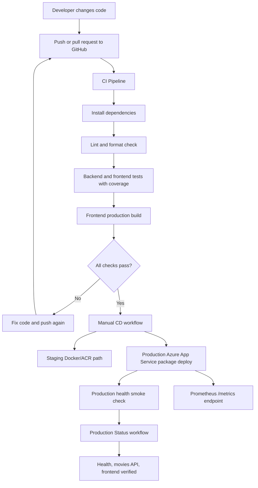

# Final Project Report

## Project Summary

This project uses the MERN Movies App as the application under test and extends it with a DevOps workflow. The final deliverable is not only the movie app; it is the automated software delivery lifecycle around the app.

The workflow covers planning, CI, testing, coverage, build, CD, production smoke checks, and monitoring evidence.

## Rubric Alignment

| Requirement                                 | Current Status | Evidence                                                                                  |
| ------------------------------------------- | -------------- | ----------------------------------------------------------------------------------------- |
| Week 1: project planning and tool selection | Complete       | DevOps track, GitHub Actions, Jest, Vitest, Docker, Azure App Service, Prometheus         |
| Week 2: workflow design and architecture    | Complete       | Pipeline diagram in `README.md` and this report                                           |
| Week 3: initial prototype and documentation | Complete       | CI workflow, Dockerfiles, compose stack, setup docs in README                             |
| Week 4: testing and refinement              | Complete       | Backend/frontend automated tests, coverage gates, linting, build, production smoke checks |
| Week 5: final presentation preparation      | Ready          | `docs/FINAL_DEMO_SCRIPT.md` and live production URLs                                      |

## Pipeline Workflow

## Current Implementation

- CI runs on pushes to any branch and pull requests targeting `main`.
- CI validates linting, formatting, backend coverage, frontend coverage, and frontend build.
- CD runs automatically after the `CI Pipeline` completes successfully on `main`.
- Staging path builds and pushes Docker images to Azure Container Registry.
- Production path deploys backend and frontend packages to Azure App Service.
- Production status workflow verifies live backend, movies API, and frontend.
- Backend exposes `/api/v1/health` and `/metrics`.
- CORS is configured through `FRONTEND_ORIGIN` so production origins can be changed without editing code.

## Production Environment

- Frontend: `https://mernmovies-web-node-81448.azurewebsites.net`
- Backend: `https://mernmovies-api-node-81448.azurewebsites.net`
- Health: `https://mernmovies-api-node-81448.azurewebsites.net/api/v1/health`
- Movies API: `https://mernmovies-api-node-81448.azurewebsites.net/api/v1/movies/all-movies`
- Metrics: `https://mernmovies-api-node-81448.azurewebsites.net/metrics`

## Issues Found And Resolved

- CI previously failed after a monitoring change removed CORS and `/metrics`; it was restored and CI is green.
- CORS previously became hardcoded to localhost; it now reads comma-separated origins from `FRONTEND_ORIGIN`.
- Older weekly docs contradicted the final state; they were removed and replaced with final-facing documentation.
- Frontend React Router dependencies were updated within the v6 line to clear known production audit issues.

## Remaining Recommendations

- Enable branch protection on `main` in GitHub settings and require the CI workflow before merge.
- Confirm the README contributor list against the official course roster.
- Run Docker Desktop before demo if the team wants to show the local compose stack live.
- Keep screenshots of the latest green CI, CD, and Production Status workflow runs for backup during presentation.
